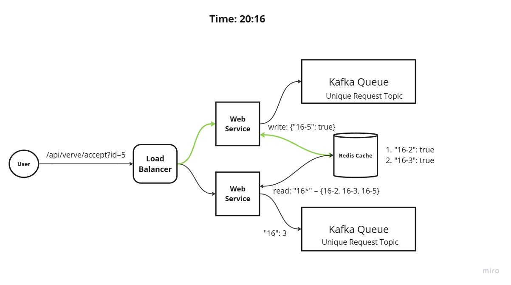

# Thought Process for Solving the challenge

## Core Requirements:
1. This service should support the API `/api/verve/accept`. With 2 query parameters:
   - id: A required parameter of type integer.
   - endpoint: An optional parameter of type string.
2. Uniqueness a request is determined by the id parameter.
3. When the endpoint is provided, the service should make a request to the endpoint with the number of unique request in the current minute.
4. At the end of each minute we need log unique request in the minute. 

## Solution to core requirements
1. We can create a map to keep track of unique request in a given minute. 
2. Whenever the API is called with an ID, it can be stored in the map with key: `current_minute-id`.
3. This way we can maintain uniqueness across minutes.
4. Within the service we can have a concurrent ticker, which ticks every minute
5. This can be achieved with Golang's supported `go routines` and the `tick` functionality in the `sync` package.
6. Thread safety in that case is maintained using `mutexes`.
7. Instead of a traditional mutex we could use a read-write mutex, which improves read perform by allowing multiple threads, to acquire the read lock at the same time.

## Building Extenstions
### Extension 1: POST Request Implementation:
- The application now sends HTTP POST requests to a given endpoint with a JSON payload containing the unique request count.

### Extension 2: Global Deduplication Across Instances:
- To ensure uniqueness across instances, Redis was introduced as a distributed key-value store.
- Redis ensures that duplicate IDs are not processed even when multiple instances of the service are deployed behind a load balancer.

### Extension 3: Kafka for Distributed Streaming:
- Instead of logging the count to a file, the application now sends the count of unique request IDs to a Kafka topic.
- Kafka is chosen for its reliability and ability to handle high-throughput data streams. This makes the system scalable and decouples the logging functionality from the application.

## Design Considerations
- **Scalability**:
  - Redis and Kafka were chosen because they are highly scalable and can handle distributed workloads. The use of these services ensures that the application will scale with the number of requests.

- **Concurrency**:
  - Golang's lightweight Goroutines ensure that the system can handle many requests simultaneously without becoming a bottleneck.

- **Fault Tolerance**:
  - By using Redis and Kafka, the system can recover gracefully in case of instance failures, since Redis stores state and Kafka provides durable message storage.

### Summary
1. **Concurrency Handling**:
    - The application uses Goroutines for handling HTTP requests to ensure non-blocking I/O operations.
    - Synchronization is achieved using mutexes (`sync.Mutex`) to manage concurrent access to shared data structures.

2. **Unique ID Deduplication**:
    - **Local Deduplication**: Initially, IDs were stored in an in-memory map. Mutexes were used to protect the map when adding new entries.
    - **Distributed Deduplication**: Redis was introduced to handle deduplication across multiple instances. Each instance of the application queries Redis to check for ID uniqueness, ensuring consistent behavior behind a load balancer.

3. **Logging**:
    - The application originally logs unique request counts to a file every minute. This is essential for tracking system performance and identifying potential issues.

4. **High-Throughput Design**:
    - Golang's built-in HTTP server is highly optimized and can handle tens of thousands of requests per second.
    - Redis provides a scalable solution for distributed deduplication, ensuring consistency across instances.
    - Kafka is used to offload logs and data from the application, providing a highly scalable messaging queue.

